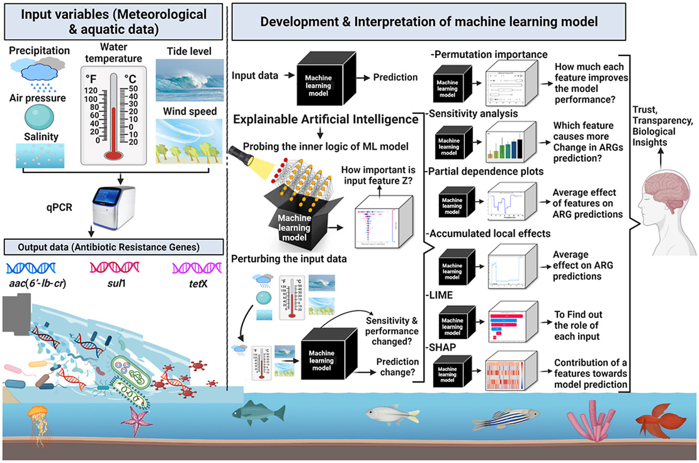

.. arg_ml documentation master file, created by
   sphinx-quickstart on Sun Oct  2 20:32:19 2022.
   You can adapt this file completely to your liking, but it should at least
   contain the root `toctree` directive.

Comparison of different XAI methods for antibiotic-resistance genes occurrence at recreational beaches
======================================================================================================

Antibiotic-resistant bacteria and antibiotic resistance genes (ARGs) are pollutants of worldwide concern
that seriously threaten public health and ecosystems. Machine learning (ML) prediction models have been
applied to predict ARGs in beach waters. However, the existing studies were conducted at a single
location and had low prediction performance. Moreover, ML models are “black boxes” that do not reveal
their predictions’ internal nuances and mechanisms. This lack of transparency and trust can result in
serious consequences when using these models in high-stakes decisions. In this study, we developed a
gradient boosted regression tree based (GBRT) ML model and then described its behavior using four
explainable artificial intelligence (XAI) model-agnostic explanation methods. These include sensitivity
analysis, permutation feature importance (PFI), partial dependence plot (PDP), and SHapley Additive
exPlanations (SHAP).

Data
----
We used hydro-meteorological and qPCR data from the beaches in South Korea and Pakistan.
10-fold cross validation method is used for performance evaluation of machine learning models.
There are three targets which are `sul1`, `tetX` and `aac(6'-lb-cr)`.
The whole data which consisted of 374 data points was split into 10 folds with equal data points. At
each iteration, the model was trained on the first k folds and tested on k+1 fold, where k is the
number of cross validation iteration.

Results
-------
The model with best cross validation performance was then selected for further analysis.
In sensitivity analysis, the bar charts indicating sensitivity indices of the input features
from methods of Morris, RBD Fast, Pawn, and Fast. Permutation importance figures shows the
decrease in R2 and Nash Sutcliff
Efficiency of `aac(6′-lb-cr)`, `sul1`, and `tetX` models as a result of random
permutations in each input feature. These plots illustrate the decrease in R2 and NSE values
during 1000 iterations of model runs. Random permutations of precipitation, wind speed, and air
pressure decreased the R2 value to 0.0 for `aac(6′-lb-cr)`, `sul1`, and `tetX` models.
A comparison of PD plots for `aac(6′-lb-cr)`, `sul1`, and `tetX` models indicates that the model’s
behavior for a single sample can vary significantly from its average behavior.
The interpretation results of SHAP for individual samples from test data are shown in figures for
all three models. These figures illustrate the SHAP feature importance for each input feature for
sample numbers 28, 29, and 30. Overall, Results indicate that water temperature, precipitation, and tide
are the most important driving factors for the abundance of ARGs at recreational beaches.

Reproducibility
---------------
To replicate the experiments, you need to install all requirements given in
requirements file .
If your results are quite different from what are presented here, then make sure
that you are using the exact versions of the libraries which were used
at the time of running of these scripts. These versions are given printed
at the start of each script. Download all the .py files in the scripts including
utils.py (:ref:`sphx_glr_auto_examples_utils.py`) file. The data is expected to be
in the data folder under the scripts folder.

.. toctree::
   :maxdepth: 2
   :caption: Contents:

   auto_examples/index

Indices and tables
==================

* :ref:`genindex`
* :ref:`modindex`
* :ref:`search`
